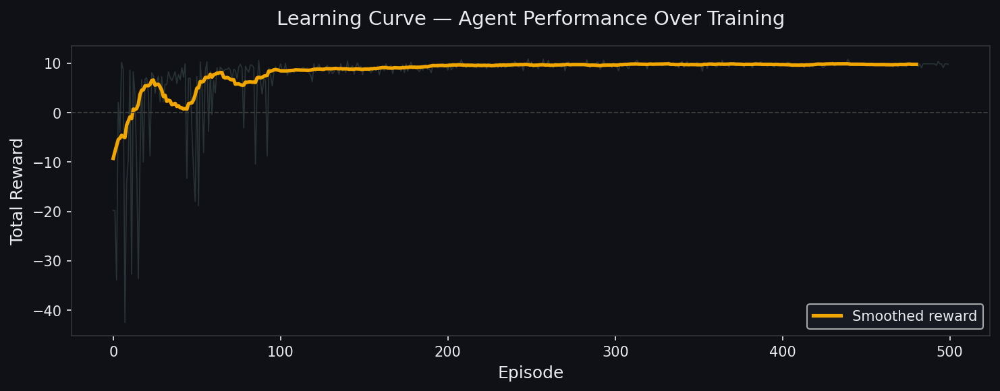
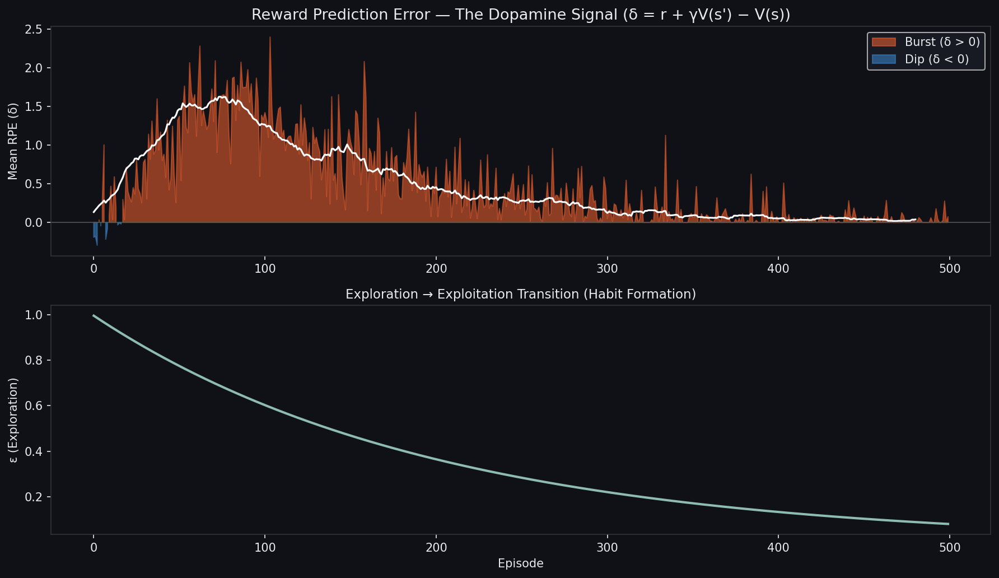
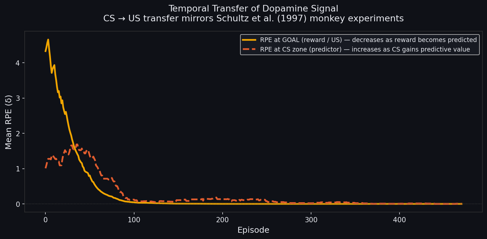
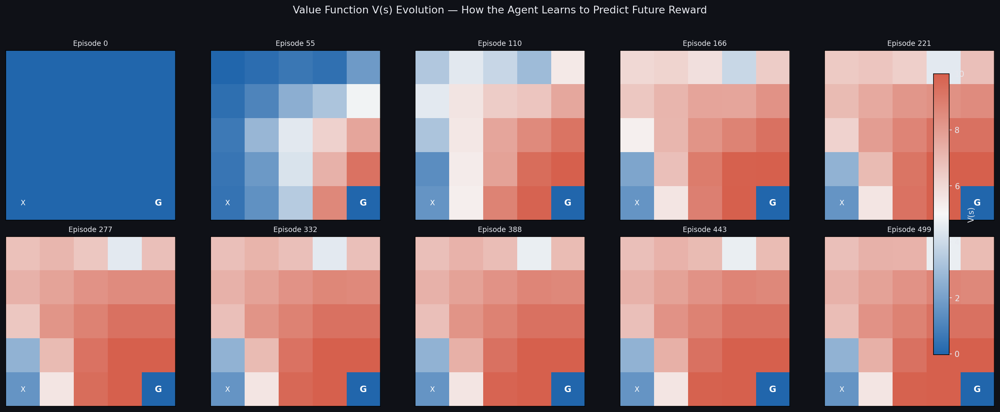
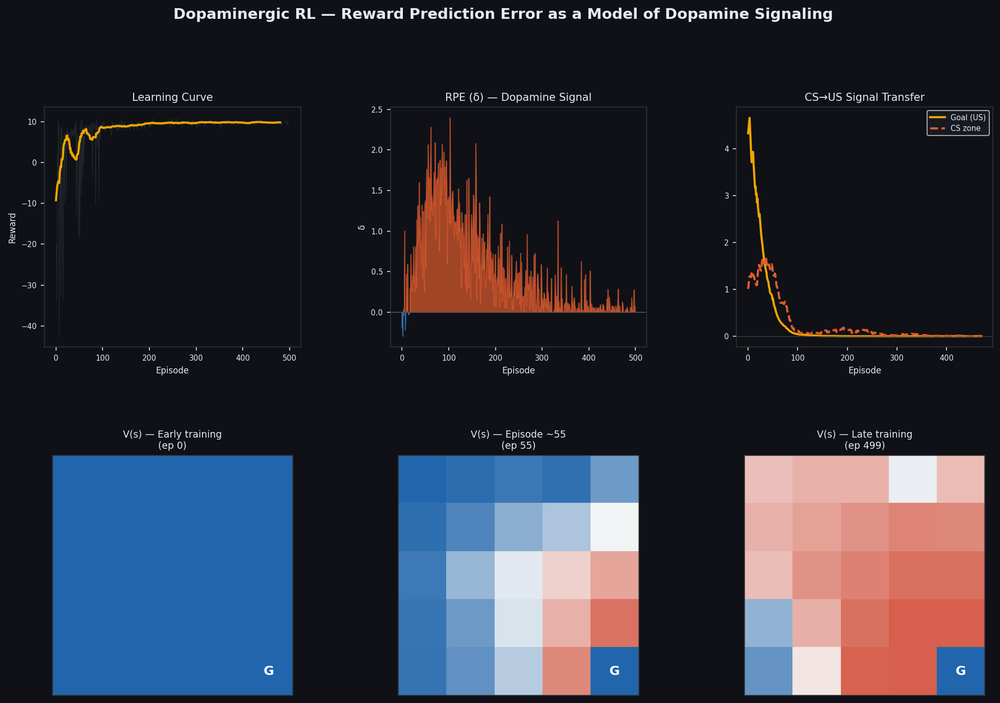

# 🧠 Dopaminergic Reinforcement Learning

> A biologically-inspired Q-Learning agent modeling **Reward Prediction Error (RPE)** — the computational basis of dopamine signaling.

---

## Motivation

In 1997, Wolfram Schultz recorded dopamine neurons in awake monkeys during conditioning tasks and made a landmark discovery: these neurons don't fire in response to reward itself — they fire in response to the **error in predicting reward**.

This Reward Prediction Error (δ) maps directly onto the **TD-error** of Temporal Difference learning:

```
δ(t) = r(t) + γ · V(s') − V(s)
```

- **δ > 0** → dopamine *burst* (better than expected)  
- **δ < 0** → dopamine *dip* (worse than expected)  
- **δ ≈ 0** → no change in firing (exactly as predicted)

This project implements a Q-Learning agent on a custom Pavlovian gridworld and tracks this signal across training, reproducing the **temporal transfer** phenomenon observed in the original monkey experiments.

---

## Results

### Graph 1 — Learning Curve



This graph answers a single question: **does the agent actually learn?**

The x-axis is the episode number (1 to 500). The y-axis is the total reward collected per episode. The faint line shows the raw per-episode signal; the bold line is a smoothed average.

Three phases are visible:

- **Episodes 1–100**: the agent wanders randomly, often falls into the trap (−5), rarely finds G. Average reward ≈ 2.
- **Episodes 100–200**: the Q-table has accumulated enough information to start making intelligent choices. The curve rises sharply.
- **Episodes 200–500**: the agent consistently reaches G in near-optimal time. Reward plateaus around **9.79**.

---

### Graph 2 — RPE Dynamics: the Dopamine Signal



This graph shows the **Reward Prediction Error δ** averaged over each episode — the direct computational analog of dopaminergic neuron firing.

The shape follows three biological phases:

- **Phase 1 (episodes 1–50)**: the Q-table is empty, the agent has no expectations. It receives rewards but was not predicting them → δ is small, not because it has learned, but because it expected nothing. This mirrors a naïve animal before conditioning.
- **Phase 2 (episodes 50–200)**: the Q-table starts forming expectations. The gap between what was expected and what was received becomes large → δ peaks. This is the active learning phase, equivalent to the burst-and-dip firing pattern seen in dopamine neurons during early conditioning.
- **Phase 3 (episodes 200–500)**: predictions become accurate. The agent is rarely surprised → δ → 0. Learning has converged.

The bottom panel shows ε (epsilon) decaying over time — the agent progressively shifts from random exploration to exploiting what it has learned, analogous to the transition from exploratory to habitual behavior.

---

### Graph 3 — Temporal Transfer of the Dopamine Signal



This is the **key neuroscience result** of the project, directly reproducing the landmark finding of Schultz et al. (1997).

Two signals are tracked episode by episode:
- **Orange**: mean δ when the agent reaches the goal G (Unconditioned Stimulus, US)
- **Red dashed**: mean δ when the agent enters the CS zone C (Conditioned Stimulus)

Early in training, only G surprises the agent — it did not predict the reward. The CS zone C is irrelevant (flat red line).

As training progresses, the agent learns that **C always precedes G**. Once this association is formed, arriving at C becomes the true surprise, while arriving at G carries no new information (it was already fully predicted). The δ signal **transfers backward in time** from the reward itself to its earliest predictor.

This is the exact phenomenon Schultz observed in awake primates: dopamine neurons initially fire at juice delivery, then — after learning — fire at the light that predicted the juice, and fall silent at the juice itself.

---

### Graph 4 — Value Function V(s) Evolution



This graph shows **10 snapshots** of the state value function V(s) = maxₐ Q(s,a) across training, as heatmaps on the 5×5 grid. Warm colors = high expected future reward; cool colors = low or negative value.

At episode 0, the grid is uniform — the agent knows nothing. Knowledge propagates **backward from G** one step at a time: cells adjacent to G are updated first, then their neighbors, and so on. By episode 500, every cell has its correct value and the agent follows the gradient from any position to reach G optimally.

The trap X (bottom-left) consistently shows a cool color — correctly learned to avoid. The CS zone C warms up earlier than its spatial neighbors because it carries a direct reward (+0.5) in addition to its proximity to G.

---

### Summary Dashboard



A single-figure overview combining all four results: learning curve (top-left), RPE dynamics (top-center), CS→US temporal transfer (top-right), and three value map snapshots at early, episode ~55, and late training (bottom row).

---

## Environment: Pavlovian Grid

A 5×5 gridworld designed to mirror classical conditioning paradigms:

```
S  .  .  .  .
.  .  .  .  .
.  .  .  .  .
.  .  .  .  .
X  .  .  C  G
```

| Cell | Role | Reward |
|------|------|--------|
| `S` | Start | — |
| `G` | Goal (Unconditioned Stimulus) | +10 |
| `C` | CS zone (Conditioned Stimulus) | +0.5 |
| `X` | Trap | −5 |
| `.` | Empty | −0.1 (step cost) |

---

## Project Structure

```
dopamine-rl/
├── src/
│   ├── agent.py         # DopaminergicAgent — Q-Learning with RPE tracking
│   ├── environment.py   # PavlovianGrid — conditioning-inspired gridworld
│   ├── train.py         # Training loop & experiment runner
│   └── visualize.py     # Publication-quality neural plots
├── results/
│   ├── agent.json       # Trained Q-table
│   ├── results.json     # Full training logs
│   ├── learning_curve.png
│   ├── rpe_dynamics.png
│   ├── temporal_transfer.png
│   ├── value_maps.png
│   └── summary_dashboard.png
└── README.md
```

---

## Installation & Usage

```bash
git clone https://github.com/<your-username>/dopamine-rl.git
cd dopamine-rl
pip install numpy matplotlib
```

**Train the agent:**
```bash
cd src
python train.py
```

**Generate plots:**
```bash
python visualize.py
```

**Customize hyperparameters** in `train.py`:
```python
run_experiment(
    n_episodes=500,
    alpha=0.1,      # learning rate (synaptic plasticity)
    gamma=0.95,     # discount factor (temporal horizon)
    epsilon=1.0,    # initial exploration rate
)
```

---

## Key Concepts

### Reward Prediction Error as a Learning Signal

The TD-error δ is computed at every timestep:

```python
def compute_rpe(self, state, action, reward, next_state, done):
    v_current = self.Q[state, action]
    v_next = 0.0 if done else np.max(self.Q[next_state])
    rpe = reward + self.gamma * v_next - v_current
    return rpe
```

This single quantity:
1. **Drives learning**: `Q(s,a) += α · δ`
2. **Encodes surprise**: large |δ| = unexpected outcome
3. **Reflects biological dopamine**: matches electrophysiology data

### Temporal Transfer

As training progresses, V(CS) increases → when the agent reaches the CS zone, the RPE for the *actual* reward delivery decreases (it's now fully predicted). This is the computational explanation for why dopamine neurons transfer their response from reward to reward-predicting cues.

---

## References

- Schultz, W., Dayan, P., & Montague, P.R. (1997). *A neural substrate of prediction and reward.* **Science**, 275(5306), 1593–1599.
- Sutton, R.S. & Barto, A.G. (2018). *Reinforcement Learning: An Introduction* (2nd ed.). MIT Press.
- Dayan, P. & Abbott, L.F. (2001). *Theoretical Neuroscience.* MIT Press.

---

## Author

**Reda Hasbi** — 1ère année, ENSEIRB-MATMECA Informatique  
Oracle Cloud Infrastructure 2025 AI Foundations Associate

*Projet réalisé en vue d'un stage à l'équipe MNEMOSYNE (Inria), dans le cadre d'un intérêt pour la modélisation cérébrale et les systèmes cognitifs intégratifs.*